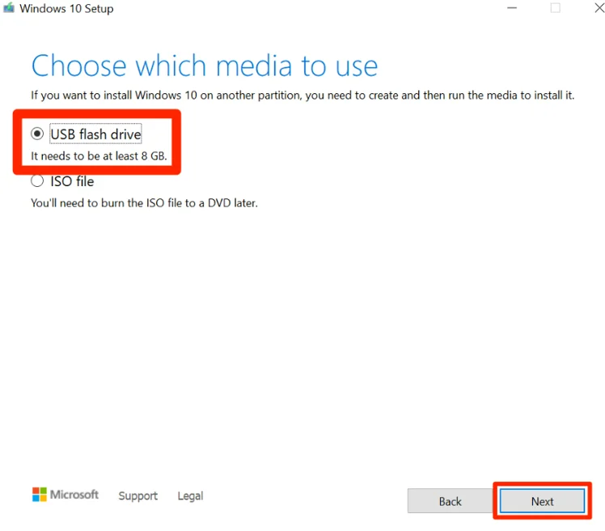
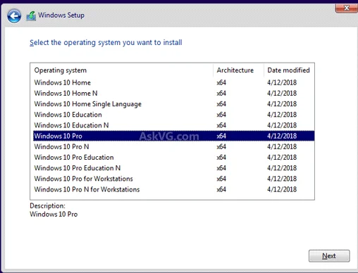

# Normal Reinstallation + Disk Bypass

### What You Need:

* USB flash drive (8GB minimum)
* Windows 10/11 ISO file
* 30-60 minutes of time
* Backup of important files

***

### Step 1: Create Bootable USB



Download and use:
* **Rufus** ([rufus.ie](https://rufus.ie)) - Recommended
* **Microsoft Media Creation Tool** - Official method


*Your USB should contain these files after creation*

***

### Step 2: Boot from USB


*Hold SHIFT and click Restart*


*Select "Use a device" then choose your USB*

**OR** Press boot key during startup:
* ASUS: F8 or Del
* MSI: F11
* Gigabyte: F12
* HP: F9 or Esc

***

### Step 3: Select Windows Version


*Choose Windows 10 Pro or Windows 11 Pro*

***

### Step 4: Skip Product Key


*Click "I don't have a product key"*

***

### Step 5: Custom Installation


*Select "Custom: Install Windows only (advanced)"*

***

### Step 6: DELETE ALL PARTITIONS



**CRITICAL:** You MUST delete ALL partitions until only "Unallocated Space" remains!


1. Select each partition
2. Click "Delete"
3. Confirm
4. Repeat until only unallocated space remains
5. Select unallocated space
6. Click "Next"

***

### Step 7: Installation Process

* Wait 15-30 minutes
* PC will restart several times automatically
* Do NOT remove USB until completely finished

***

### Step 8: Windows Setup - CREATE OFFLINE ACCOUNT


*Click "Offline account" in bottom left*


**DO NOT:**
* Connect to internet during setup
* Sign in with Microsoft account
* Use Edge browser after installation


***

### Step 9: Privacy Settings


*Turn OFF all privacy settings*

***

### Step 10: Change Disk Serial

After Windows is installed, open Command Prompt as Administrator:

```cmd
diskpart
list disk
select disk 0
uniqueid disk
```

You'll see current serial. Now change it:

```cmd
uniqueid disk ID=9F8E7D6C
```


Use random alphanumeric characters. Example: `4B7K9M2P` or `8X3V5N1Q`


Verify the change:
```cmd
uniqueid disk
exit
```

***


**Setup Complete!** Now proceed to BIOS Configuration

