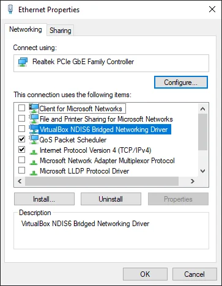

# Network Unflag

تنظيف بصمة الشبكة الخاصة بك لضمان عدم تتبعك عبر الإنترنت.

---

## 🌐 لماذا Network Unflag؟

الألعاب تتتبع أيضاً:
- 📡 MAC Address
- 🌍 IP Address  
- 🔧 إعدادات Network Adapter
- 📊 Network Stack fingerprint

**يجب تنظيف كل هذا!**

---

## 🔧 الخطوة 1: تعطيل Adapters غير المستخدمة

```
1. اضغط Win + R
2. اكتب: ncpa.cpl
3. اضغط OK
```

**عطّل كل شيء إلا Ethernet:**
- ❌ WiFi
- ❌ Bluetooth
- ❌ Virtual adapters
- ✅ Ethernet فقط

> 💡 **Click يمين → Disable**

---

## ⚙️ الخطوة 2: ضبط خصائص Ethernet


*قائمة خصائص Ethernet - أطفئ كل شيء إلا IPv4*

**على Ethernet adapter:**

```
1. Click يمين → Properties
2. أطفئ جميع البروتوكولات غير الضرورية
```

### ما يجب أن يكون مفعّل ✅:
- ✅ Internet Protocol Version 4 (TCP/IPv4)

### ما يجب أن يكون مطفي ❌:
- ❌ Internet Protocol Version 6 (TCP/IPv6)
- ❌ Client for Microsoft Networks
- ❌ File and Printer Sharing
- ❌ QoS Packet Scheduler
- ❌ Link-Layer Topology Discovery
- ❌ VirtualBox NDIS6 Bridged Networking Driver
- ❌ كل شيء آخر!

---

## 🛠️ الخطوة 3: إعدادات Advanced

**في نفس نافذة Properties:**

```
1. اضغط Configure
2. تبويب Advanced
3. اضبط هذه الإعدادات:
```

| الإعداد | القيمة |
|---------|--------|
| **Advanced EEE** | Disabled |
| **Network Address** | Not Present |
| **ARP Offload** | Disabled |
| **Flow Control** | Disabled |
| **IPv4 Checksum Offload** | Disabled |
| **Large Send Offload v2 (IPv6)** | Disabled |
| **TCP Checksum Offload (IPv6)** | Disabled |
| **UDP Checksum Offload (IPv6)** | Disabled |

> 💡 **إذا لم تجد إعداد معين، تخطاه**

---

## 🧹 الخطوة 4: تنظيف DNS و Network Stack

**افتح CMD كـ Administrator واكتب الأوامر واحدة واحدة:**

```cmd
ipconfig /flushdns
ipconfig /registerdns
ipconfig /release
ipconfig /renew
netsh winsock reset
```

**أعد تشغيل الكمبيوتر** 🔄

---

## 🗑️ الخطوة 5: مسح ARP Cache

**بعد إعادة التشغيل، CMD كـ Admin:**

```cmd
arp -d
netsh interface IP delete arpcache
```

**أعد التشغيل مرة أخرى** 🔄

---

## ✅ التحقق

**تحقق من إعداداتك:**

```cmd
ipconfig /all
```

يجب أن ترى:
- ✅ MAC Address جديد (إذا عملت MAC Spoof)
- ✅ IPv4 Address فقط
- ✅ No IPv6

---

## 🎯 الخطوة التالية

تم! الآن أكمل:

➡️ [Make a New Account](new-account.md)

---

## 💡 نصائح إضافية

### لمزيد من الحماية:

1. 🔄 أعد تشغيل الراوتر (IP جديد)
2. 📞 اتصل بمزود الخدمة لطلب IP جديد
3. 🔌 افصل الراوتر 5 دقائق ثم أعد توصيله

---

## 📋 Checklist النهائي

قبل المتابعة، تأكد من:

- [ ] جميع Adapters الزائدة معطلة
- [ ] Ethernet Properties مضبوطة صحيح
- [ ] Advanced Settings مضبوطة
- [ ] DNS و Winsock تم تنظيفهما
- [ ] ARP Cache تم مسحه
- [ ] أعدت التشغيل مرتين

---

**السابق:** [Spoof Monitor](spoof-monitor.md) | **التالي:** [New Account](new-account.md)
