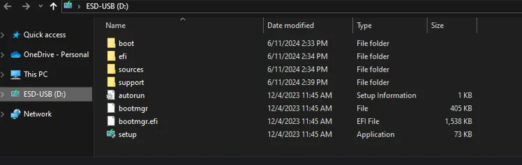
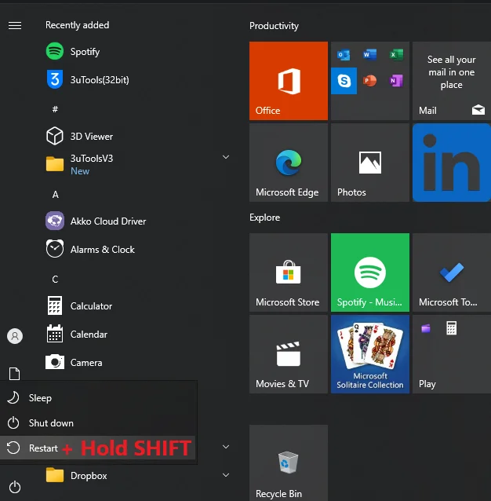
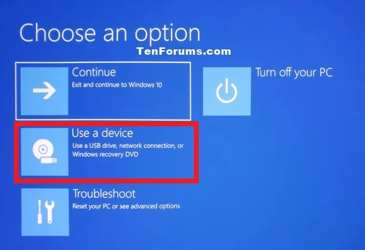
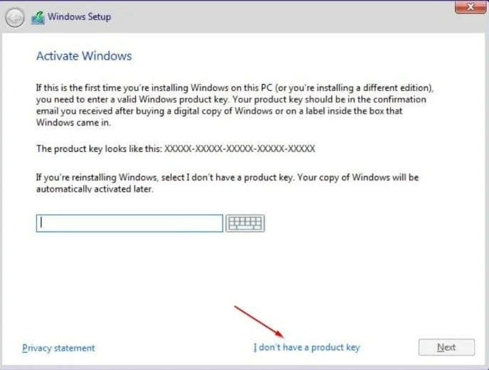
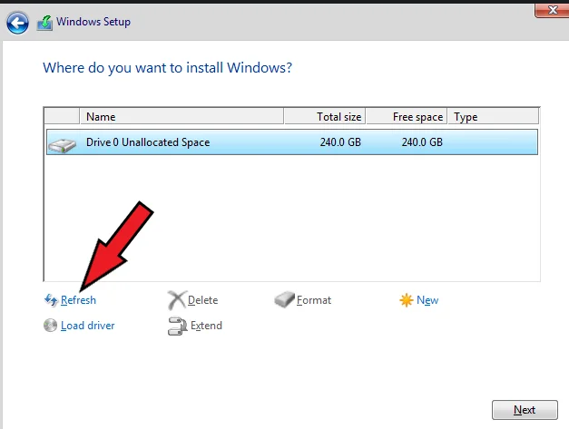

# Normal Reinstallation + Disk Bypass

الطريقة القياسية لإعادة تثبيت Windows مع تغيير Serial Number للقرص الصلب.

---

## 🎯 لمن هذه الطريقة؟

✅ معظم المستخدمين  
✅ قرص صلب واحد  
✅ أول مرة تستخدم Spoofer  
✅ جميع الألعاب (ما عدا Valorant تحتاج BIOS Flash)

---

## 📦 ما تحتاجه

| الشيء | الحجم/النوع |
|-------|-------------|
| 💾 **USB** | 8GB على الأقل |
| 💿 **Windows ISO** | Windows 10 أو 11 |
| ⏱️ **وقت** | 30-60 دقيقة |
| 🔌 **إنترنت** | لتحميل Windows |

---

## 🔥 الخطوة 1: إنشاء USB قابل للإقلاع


*اختر USB flash drive للمتابعة*

### الطريقة أ: Rufus (موصى بها)

```
1. حمّل Rufus من rufus.ie
2. أدخل USB
3. اختر Windows ISO
4. اضغط START
5. انتظر حتى ينتهي
```

[📥 تحميل Rufus](https://rufus.ie/)

### الطريقة ب: أداة Microsoft

```
1. حمّل Media Creation Tool
2. اختر "Create installation media"
3. اتبع المعالج
```

[📥 Media Creation Tool](https://www.microsoft.com/software-download/windows10)

---

## 💻 الخطوة 2: الإقلاع من USB


*محتويات USB بعد الإنشاء - تحقق من الملفات*

### للدخول لقائمة Boot:


*اضغط Hold SHIFT ثم Restart من قائمة Start*


*اختر "Use a device" لاختيار USB*

**أو استخدم مفتاح Boot:**
- **ASUS**: F8 أو Del
- **MSI**: F11
- **Gigabyte**: F12
- **HP**: F9 أو Esc

---

## 🎨 الخطوة 3: اختيار إصدار Windows


*اختر Windows 10 Pro (موصى به)*

---

## 🔑 الخطوة 4: تخطي Product Key


*اضغط "I don't have a product key" للمتابعة*

---

## 🛠️ الخطوة 5: Custom Installation


*اختر "Custom: Install Windows only (advanced)"*

---

## 🗑️ الخطوة 6: حذف الأقسام (مهم!)


*احذف **جميع** الـ Partitions حتى يبقى Unallocated Space فقط*

> ⚠️ **سيحذف كل شيء على القرص!**

```
1. اختر Partition
2. اضغط Delete
3. كرر لكل Partition
4. يجب أن يبقى "Unallocated Space" فقط
5. اختره واضغط Next
```

**لماذا نحذف الكل؟**  
🔸 لإزالة أي آثار قديمة  
🔸 Registry نظيف تماماً  
🔸 نجاح Spoof بنسبة أعلى

---

## ⏳ الخطوة 7: تثبيت Windows

```
1. انتظر 15-30 دقيقة
2. سيعيد التشغيل عدة مرات - طبيعي!
3. لا تفصل USB حتى يكتمل التثبيت
```

---

## 🎨 الخطوة 8: الإعداد الأولي

### إنشاء حساب محلي (مهم!)


*اختر "Offline account" في الزاوية اليسرى السفلية*

> 💡 **مهم:** لا تتصل بالإنترنت ولا تسجل دخول لحساب Microsoft القديم!

### إعدادات الخصوصية


*أطفئ **جميع** إعدادات الخصوصية*

| السؤال | الإجابة |
|---------|---------|
| **Region** | اختر بلدك |
| **Keyboard** | اختر لغتك |
| **Connect to network** | ❌ **Skip for now** |
| **Sign in** | ❌ اختر **Offline account** |
| **Microsoft account** | ❌ "Sign in with local account" |
| **Privacy settings** | ❌ أطفئ **الكل** |
| **Cortana** | ❌ لا |

---

## 🔢 الخطوة 9: تغيير Disk Serial

**بعد تثبيت Windows:**

1. افتح **Command Prompt** كـ Administrator
2. اكتب هذه الأوامر **واحدة واحدة**:

```cmd
diskpart
list disk
select disk 0
uniqueid disk
```

سترى Serial الحالي، مثل:
```
Disk ID: 1A2B3C4D
```

3. الآن غيّره لـ Serial عشوائي:

```cmd
uniqueid disk ID=9F8E7D6C
```

> 💡 **استخدم أرقام وحروف عشوائية!**  
> مثال: `4B7K9M2P` أو `8X3V5N1Q`

4. تحقق من التغيير:

```cmd
uniqueid disk
exit
```

يجب أن ترى Serial الجديد! ✅

---

## 🎯 الخطوة 10: إعداد ما بعد التثبيت

**الآن افعل هذه بالترتيب:**

```
1. لا تثبت Windows Updates ❌
2. لا تسجل دخول لأي حساب قديم ❌
3. لا تثبت ألعاب بعد ❌
4. أكمل للخطوة التالية ✅
```

---

## ✅ تم التثبيت!

**الآن انتقل للخطوة التالية:**

➡️ [BIOS Configurations](../bios-config.md)

**أو ارجع للخطوات السابقة:**

⬅️ [Windows Reinstall Options](README.md)

---

## 🆘 استكشاف الأخطاء

### لا يمكن حذف Partition
- قد يكون محمي. استخدم:
```cmd
diskpart
list disk
select disk 0
clean
```

### Serial لم يتغير
- تأكد أنك تستخدم Disk 0
- جرب Serial آخر
- استخدم حروف وأرقام فقط (بدون رموز)

### Windows لم يقلع
- تحقق من BIOS boot order
- تأكد أن USB تم إنشاؤه صحيح

---

**جاهز؟** → [BIOS Configuration](../bios-config.md) 🚀
